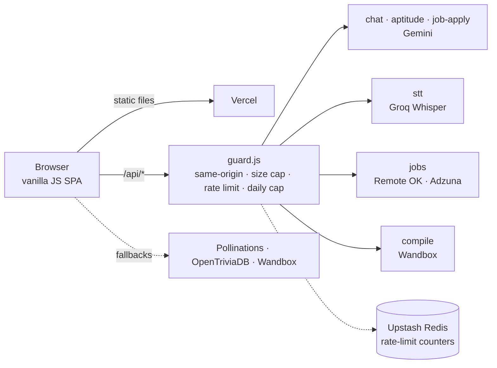

# PlacementPrep — AI Campus Placement Portal

[](https://github.com/tanp4577-web/AiplacementTracker/actions/workflows/ci.yml)

**Live demo:** https://aiplacement-tracker.vercel.app — use **Continue as guest** to try everything without signing up.

PlacementPrep is a browser-based placement preparation suite: analyse your resume, match it against live job listings with an AI ATS score, practise aptitude and coding questions, track skill gaps, and study company interview patterns. A voice-enabled AI assistant answers placement questions.

<!--
Add 3–4 screenshots or one short GIF here — it is the biggest upgrade for anyone glancing at this repo.
Suggested: docs/screenshots/dashboard.png, hiring-hub.png, resume-analyzer.png

-->

## Features

| Module | What it does |
| --- | --- |
| **Dashboard** | Readiness overview across all modules |
| **Resume Analyzer** | Extracts text from PDF / DOCX / TXT / RTF in the browser and scores it against a target role |
| **Aptitude Quiz** | AI-generated questions (Gemini) with OpenTriviaDB and offline question banks as fallbacks |
| **Coding Practice** | Practice problems, including C++ questions with test cases run through the Wandbox compiler |
| **Interview Experiences** | Interview rounds and tips you add, filterable by company and difficulty (stored in your browser) |
| **Hiring Hub** | Live listings from Remote OK (global remote) and Adzuna (India, incl. internships); **Analyze resume fit** returns an ATS match score, matched/missing skills, learning actions and practice interview questions |
| **Skill Gap** | Compares your skills to target roles |
| **Company Patterns** | Typical hiring rounds per company |
| **YouTube Lectures** | Curated lecture playlists with watch tracking |
| **Lecture Questions** | Timestamped subject questions with a runnable C++ editor |
| **PrepAI Assistant** | Chatbot (Gemini) with voice input; falls back to a keyless public model if the API is unavailable |
| **Admin view** (`/admin`) | Local demo dashboard over data stored in the current browser |

## Architecture



- **Frontend:** plain HTML/CSS/JS with no build step. Feature modules live in `js/`, curated data in `js/data/`.
- **Backend:** Vercel serverless functions (ES modules) in `api/`. Provider keys are read only on the server.
- **Abuse protection:** every route calls `api/_lib/guard.js`, and every Gemini call goes through `api/_lib/gemini.js` (key in a header, request timeout, no deprecated sampling parameters).
- **Text-to-speech:** the browser's `SpeechSynthesis`. `/api/tts` exists only as a placeholder because Edge-TTS is a Python service that can't run on Vercel's Node runtime.

## Run locally

```bash
git clone https://github.com/tanp4577-web/AiplacementTracker.git
cd AiplacementTracker
npm install
cp .env.example .env.local        # then fill in your keys
npx vercel dev                    # serves the site and the /api routes
```

Use HTTPS or `http://localhost` — browsers only allow the microphone there. Chrome or Edge is recommended for speech recognition.

```bash
npm run lint       # ESLint on api/ and tests/
npm run lint:all   # also lints js/ (a cleanup backlog, not enforced in CI yet)
npm test           # API route tests + browser-side tests (jsdom)
```

## Environment variables

Set these in **Vercel → Project → Settings → Environment Variables** (Production, and Preview if needed). See [`.env.example`](.env.example).

| Variable | Required | Used for |
| --- | --- | --- |
| `GEMINI_API_KEY` (or `LLM_API_KEY`) | Yes | Chat, aptitude generator, Hiring Hub ATS |
| `GROQ_API_KEY` | For voice input | `/api/stt` speech-to-text (Whisper) |
| `ADZUNA_APP_ID`, `ADZUNA_APP_KEY` | For the India jobs tab | Free keys from https://developer.adzuna.com |
| `UPSTASH_REDIS_REST_URL`, `UPSTASH_REDIS_REST_TOKEN` | Recommended | Shared rate-limit counters across serverless instances |
| `GEMINI_MODEL`, `GEMINI_BASE_URL` | No | Default to `gemini-3.5-flash-lite` and the public Gemini v1beta endpoint |
| `ALLOWED_ORIGINS` | No | Extra origins allowed to call `/api` (same-origin always works) |

Do **not** add `VERCEL_OIDC_TOKEN` — it is a local deployment credential managed by Vercel.

## API routes

All routes are same-origin only, size-capped and rate-limited per client IP (defaults shown per 10 minutes).

| Route | Method | Purpose | Limit |
| --- | --- | --- | --- |
| `/api/chat` | POST | PrepAI chatbot (last 20 messages, 4,000 chars each) | 30 |
| `/api/aptitude` | POST | Generate up to 20 quiz questions | 10 |
| `/api/job-apply` | POST | Resume-vs-job ATS analysis (resume capped at 20,000 chars) | 8 |
| `/api/stt` | POST | Speech-to-text, audio up to 4 MB | 30 |
| `/api/compile` | POST | C++ compile/run through Wandbox (allow-listed compilers, 30,000-char code cap) | 30 |
| `/api/jobs` | GET | Live job listings (Remote OK / Adzuna), edge-cached for 5 minutes | 60 |
| `/api/tts` | POST | Placeholder that tells the client to use browser speech | 60 |

Each AI route also has a global per-day ceiling so a misbehaving client can't run up your bill. Tune the numbers in each route's `guard()` call.

## Privacy and data

- Accounts, progress and interview experiences are stored in your browser's `localStorage`. Clearing site data removes them, and they do not sync across devices.
- Resume files are parsed in the browser. Only the extracted **text** is sent to `/api/job-apply` (Gemini); the original file is not uploaded or stored.
- Chat messages go to `/api/chat` (Gemini). If that fails, the client may fall back to Pollinations, a third-party public service.
- Voice answers are sent to `/api/stt` (Groq Whisper) for transcription.
- Remote OK requires attribution: the Hiring Hub links back to remoteok.com on every listing. Do not remove it.
- `app.py` is an optional local Flask helper for recordings (`http://localhost:5000/upload-proof`). Nothing in the current UI calls it.

## Security notes

- API keys live only in server environment variables; a CI step fails the build if a key-shaped string is committed.
- `vercel.json` sets security headers, an enforced `frame-src` policy, and a full Content-Security-Policy in **report-only** mode. Load the site, check the browser console for violations, then rename that header to `Content-Security-Policy` to enforce it.
- Third-party and AI-generated text is escaped with `Sanitize.html()` (`js/sanitize.js`) before it is placed in the DOM; tests cover this.
- **Known limitation:** sign-in is local to the browser (a password hash in `localStorage`), so it is a profile, not server-side authentication. The `/admin` page is likewise a local demo — anyone can promote their own local account. Do not store sensitive data in it.

## Roadmap

- [ ] Real authentication and a database so progress syncs across devices
- [ ] Application tracker (applied → online assessment → interview → offer)
- [ ] Move the frontend to ES modules and add browser end-to-end tests
- [ ] Multi-language coding runner (Java, Python)
- [ ] Show the readiness-score formula in the UI

## Contributing

Issues and pull requests are welcome. Please run `npm run lint && npm test` first.

## License

Copyright (c) 2026. All rights reserved — see the notices in the source files.
