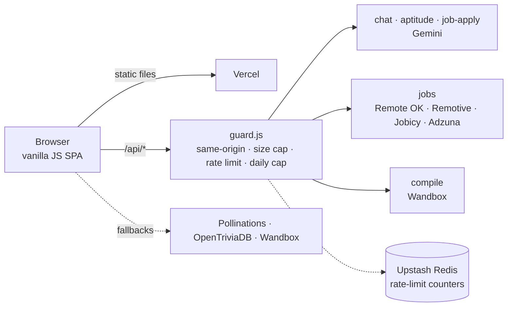

# PlacementPrep — AI Campus Placement Portal

[](https://github.com/tanp4577-web/AiplacementTracker/actions/workflows/ci.yml)

**Live demo:** https://aiplacement-tracker.vercel.app — use **Continue as guest** to try everything without signing up.

PlacementPrep is a browser-based placement preparation suite: analyse your resume, match it against live job listings with an AI ATS score, practise aptitude and coding questions, track skill gaps, and study company interview patterns. An AI assistant answers placement questions.

<!--
Add 3–4 screenshots or one short GIF here — it is the biggest upgrade for anyone glancing at this repo.
Suggested: docs/screenshots/dashboard.png, hiring-hub.png, resume-analyzer.png

-->

## Features

| Module | What it does |
| --- | --- |
| **Dashboard** | Readiness overview across all modules, with the exact score formula, a "Start here" checklist for new users, and **Export / Import backup** so local progress is never trapped in one browser |
| **Resume Analyzer** | Extracts text from PDF / DOCX / TXT / RTF in the browser and scores it against a target role |
| **Aptitude Quiz** | AI-generated questions (Gemini) with OpenTriviaDB and offline question banks as fallbacks |
| **Coding Practice** | Practice problems, including C++ questions with test cases run through the Wandbox compiler |
| **Interview Experiences** | Interview rounds and tips you add, filterable by company and difficulty (stored in your browser) |
| **Hiring Hub** | **India (Local)** tab for city jobs and internships (Adzuna), never blank: without Adzuna keys it shows remote roles open to India plus pre-filled searches on Internshala, LinkedIn, Naukri, Indeed and Google Jobs. **Remote (Global)** tab merges Remote OK, Remotive and Jobicy (Jobicy tags internships explicitly). **Analyze resume fit** returns an ATS match score, matched/missing skills, learning actions and practice interview questions |
| **Skill Gap** | Compares your skills to target roles |
| **Company Patterns** | Typical hiring rounds per company |
| **YouTube Lectures** | Curated lecture playlists with watch tracking |
| **Lecture Questions** | Timestamped subject questions with a runnable C++ editor |
| **PrepAI Assistant** | Chatbot (Gemini); falls back to a keyless public model if the API is unavailable |
| **Admin view** (`/admin`) | Local demo dashboard over data stored in the current browser |

## Architecture



- **Frontend:** plain HTML/CSS/JS with no build step. Feature modules live in `js/`, curated data in `js/data/`.
- **Backend:** Vercel serverless functions (ES modules) in `api/`. Provider keys are read only on the server.
- **Abuse protection:** every route calls `api/_lib/guard.js`, and every Gemini call goes through `api/_lib/gemini.js` (key in a header, request timeout, no deprecated sampling parameters).

## Run locally

```bash
git clone https://github.com/tanp4577-web/AiplacementTracker.git
cd AiplacementTracker
npm install
cp .env.example .env.local        # then fill in your keys
npx vercel dev                    # serves the site and the /api routes
```

```bash
npm run lint       # ESLint on api/ and tests/
npm run lint:all   # also lints js/ (a cleanup backlog, not enforced in CI yet)
npm test           # API route tests + browser-side tests (jsdom)
```

## Environment variables

Set these in **Vercel → Project → Settings → Environment Variables** (Production, and Preview if needed). See [`.env.example`](.env.example).

| Variable | Required | Used for |
| --- | --- | --- |
| `GEMINI_API_KEY` (or `LLM_API_KEY`) | Yes | Chat, aptitude generator, Hiring Hub ATS |
| `ADZUNA_APP_ID`, `ADZUNA_APP_KEY` | For real local jobs and internships | Free keys from https://developer.adzuna.com (see [Hiring Hub setup](#hiring-hub-setup)) |
| `UPSTASH_REDIS_REST_URL`, `UPSTASH_REDIS_REST_TOKEN` | Recommended | Shared rate-limit counters across serverless instances |
| `GEMINI_MODEL`, `GEMINI_BASE_URL` | No | Default to `gemini-3.5-flash-lite` and the public Gemini v1beta endpoint |
| `ALLOWED_ORIGINS` | No | Extra origins allowed to call `/api` (same-origin always works) |

Do **not** add `VERCEL_OIDC_TOKEN` — it is a local deployment credential managed by Vercel.

## API routes

All routes are same-origin only, size-capped and rate-limited per client IP (defaults shown per 10 minutes).

| Route | Method | Purpose | Limit |
| --- | --- | --- | --- |
| `/api/chat` | POST | PrepAI chatbot (last 20 messages, 4,000 chars each) | 30 |
| `/api/aptitude` | POST | Generate up to 20 quiz questions | 10 |
| `/api/job-apply` | POST | Resume-vs-job ATS analysis (resume capped at 20,000 chars) | 8 |
| `/api/compile` | POST | C++ compile/run through Wandbox (allow-listed compilers, 30,000-char code cap) | 30 |
| `/api/jobs` | GET | Live listings: `source=india` (Adzuna, or remote-for-India fallback) or `source=remote` (Remote OK + Remotive + Jobicy); supports `q`, `where`, `distance`, `internship=1`, `page`. Edge-cached 1–5 minutes | 60 |

Each AI route also has a global per-day ceiling so a misbehaving client can't run up your bill. Tune the numbers in each route's `guard()` call.

## Hiring Hub setup

The **India (Local)** tab is the app's main feature. It has three levels, and it never shows an empty page:

| Situation | What the tab shows |
| --- | --- |
| Adzuna keys set and working | Real on-site jobs and internships in India, searchable by keyword and city (`mode: adzuna`) |
| No keys, or Adzuna is down | Remote roles and internships open to candidates in India from Remote OK, Remotive and Jobicy (all key-free), a notice explaining why, and pre-filled search links for Internshala, LinkedIn, Naukri, Indeed and Google Jobs (`mode: remote-fallback`) |
| Both remote feeds down | The last good copy is served; only if none exists does the tab show an error with a **Try again** button |

To get real local jobs and internships (about 5 minutes, free):

1. Sign up at https://developer.adzuna.com and create an application to get an **App ID** and **App Key**.
2. In Vercel open **Project → Settings → Environment Variables** and add `ADZUNA_APP_ID` and `ADZUNA_APP_KEY` for Production (and Preview if you test there).
3. Redeploy. The banner about "on-site local listings" disappears and the source note changes to "via Adzuna".

Adzuna's free tier has a daily call limit, so the India route allows 300 Adzuna searches a day in total and answers repeat searches from the edge cache. Change the number in `api/jobs.js` if your plan allows more.

Attribution is required: Remote OK, Remotive and Jobicy listings link back to the original posting and credit the source. Remotive and Jobicy ask not to be polled often, so their feeds are cached for 6 and 3 hours. Do not remove those credits.

## Privacy and data

- Accounts, progress and interview experiences are stored in your browser's `localStorage`. Clearing site data removes them, and they do not sync across devices.
- Resume files are parsed in the browser. Only the extracted **text** is sent to `/api/job-apply` (Gemini); the original file is not uploaded or stored.
- Chat messages go to `/api/chat` (Gemini). If that fails, the client may fall back to Pollinations, a third-party public service.
- Remote OK and Remotive require attribution: the Hiring Hub links back to the original listing and credits the source. Do not remove it.

## Security notes

- API keys live only in server environment variables; a CI step fails the build if a key-shaped string is committed.
- `vercel.json` sets security headers, an enforced `frame-src` policy, and a full Content-Security-Policy in **report-only** mode. Load the site, check the browser console for violations, then rename that header to `Content-Security-Policy` to enforce it.
- Third-party and AI-generated text is escaped with `Sanitize.html()` (`js/sanitize.js`) before it is placed in the DOM; tests cover this.
- **Known limitation:** sign-in is local to the browser (a password hash in `localStorage`), so it is a profile, not server-side authentication. The `/admin` page is likewise a local demo — anyone can promote their own local account. Do not store sensitive data in it.

## Quality checklist

- Accessible: skip link, visible keyboard focus, labelled chatbot button, focus kept inside the sign-in dialog, per-page titles, faint text darkened to meet WCAG AA contrast.
- Resilient: if the browser blocks storage the app keeps working from memory and tells the user once.
- Shareable and installable: favicon, Open Graph / Twitter preview image, web manifest, `robots.txt`, `sitemap.xml`, and a `<noscript>` message.
- Lean: the unused Font Awesome stylesheet was removed.
- Theme: one emerald/teal palette (`--accent: #097a54`, white text on it is 5.4:1); no blue or violet anywhere, and a test fails if one comes back. Change the look by editing the `:root` block at the top of `css/depth-theme.css`.
- Calm motion: cards fade in when a view first appears or data arrives, never again because you typed in a search box or changed a filter.

## Roadmap

- [ ] Real authentication and a database so progress syncs across devices
- [ ] Application tracker (applied → online assessment → interview → offer)
- [ ] Move the frontend to ES modules and add browser end-to-end tests
- [ ] Multi-language coding runner (Java, Python)

## Contributing

Issues and pull requests are welcome. Please run `npm run lint && npm test` first.

## License

Copyright (c) 2026. All rights reserved — see the notices in the source files.
